# 五线谱翻译为简谱教程（第一版）

## 1. 说明

1. 作者并未接受过严格、系统、专业的乐理、译谱训练，所以以下内容不免有疏漏、错误之处，还请读者指正。可以联系 <EMAIL>JyEggRoll@outlook.com<EMAIL> 进行反馈；
2. 本教程主要供管乐竹笛声部学习使用，其他乐器可以参考本教程进行学习，但不保证完全准确；
3. 本教程以《太阳颂》为例，其他乐曲也可以参考本教程进行学习，但不保证完全准确；
4. 本教程的目的不在于事无巨细地构建知识框架，而是以最简单、直观的方式帮助大家快速上手，尤其是《太阳颂》的翻译工作；
5. 本教程默认您有一定的简谱乐理基础；
6. [本教程](https://github.com/Jy-EggRoll/Translating-pentatonic-scores-to-simplified-scores)已开源，欢迎添加 Star；
7. [版权声明](https://jy-eggroll.github.io/my-page/html/copyright.html)

## 2. 工具介绍

### 2.1. 主要工具

[番茄简谱](http://zhipu.lezhi99.com/)（浏览器网页，推荐用 Chrome、Edge 浏览器打开，打开后注册可以直接上手使用。登录后，应该会获得一个大小未知的云存储空间用来存放简谱文件。）

效果展示：

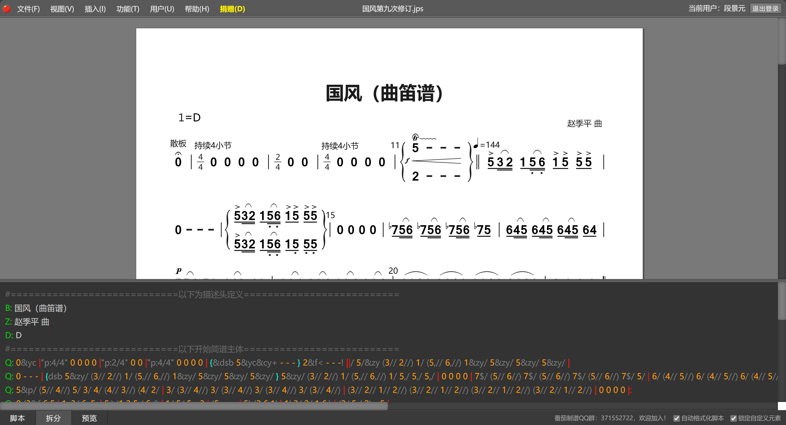

### 2.2. 次要工具（可以选择性使用以优化体验）

1. SumatraPDF（速度很快的 PDF 阅读器，可以被任何 PDF 阅读器代替）
2. PixPin（截图贴图软件，可以被任意截图贴图软件代替）

由于是次要工具，更像是我个人的软件推荐，所以这个部分会放到文章的最后来讲。

##  3. 基本知识

1. 五线谱与简谱音的对照

    此图最适用的的情况是 1 = C，您需要做的是明确五线谱上音的位置（处于线上或间中）。至于其他首调的对照表，您很快会在后文见到。那张表是最有助于译谱的。

    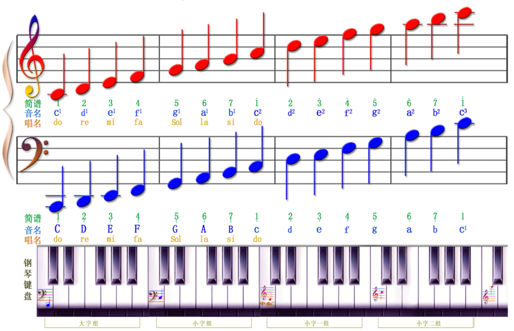

2. 五线谱与简谱节奏的对照

    本图所列的是译谱要必须掌握的一些符号，关于装饰音和技法不会太多提及。如果您遇到了没见过的符号，大可以使用搜索引擎或者直接询问他人。您需要着重记忆的是`休止符`的记法。在译谱过程中，您很快会发现，在通常情况下，音符有几条“小尾巴”，就对应简谱中的几条减时线。

    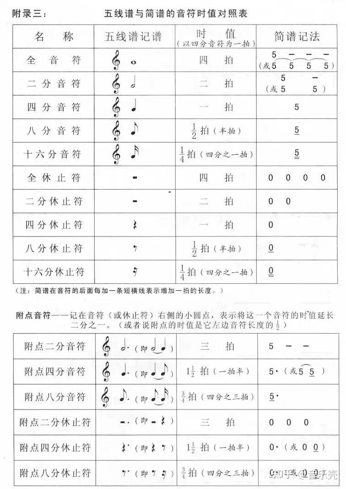

3. 如何确定 1 = ?，即确定首调

    主要是看五线谱**行**前面的符号，小节内出现了熟悉位置的升降号，则要辅以实际音律判定首调。以《太阳颂》为例：

    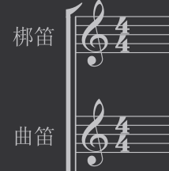

    如果没有看到升降号，那么翻译成 1 = C 或者其他可能首调。

    举个例子，梆笛翻译为 1 = G 是很常用且很自然的，G 调只有一个升号，那么如何将容易翻译的 1 = C 转化为 1 = G 呢，稍后我会附上常用大调的对照表。

    此外，如果读者对于谱号后的升降号个数对应的大调不熟悉，也可以参看后文的对照表。或者，您可以直接通过搜索引擎查找，示例为`一个升号对应什么大调`。在民乐团中，常用到的首调是 C 调、D 调、G 调。您可以简单地认为大调基本等同于首调。

4. 升降号的生命周期

    **这一点非常重要，也常常引起误解**。这是因为在简谱中，升降号是很少见的，简谱读者对此并不熟悉。所以，如果您发现您翻译出的简谱出现了大量的升降号，并且严重影响了演奏指法，您就要考虑是否可以更换首调了。

    1. 写在谱号（即五线谱每行开头的符号）后的升降号，将作用于**一整行以及其他八度的同音**。这会给我们在确定首调后的译谱工作带来很大的便利，稍后我会解释原因。
    2. 在小节中出现的升降号，**作用于一小节内的这个音，不作用于其他八度的同音**。这一点是引起误解最多的地方。在小节中，某个音加上了升降号，如果这个音再次出现，其实际音高就是保留升降号的，不需要还原。
   
5. 关于升降号的更多知识

    我推荐您将《[一篇文章读懂升降号](https://zhuanlan.zhihu.com/p/31872055)》这篇短文的第一到第四部分阅读一次，第五部分极少用到，您可以直接略过。

## 4. 以《太阳颂》为例，快速上手翻译简谱

1. 打开[番茄简谱](http://zhipu.lezhi99.com/)，注册登录后，新建一个文件。

    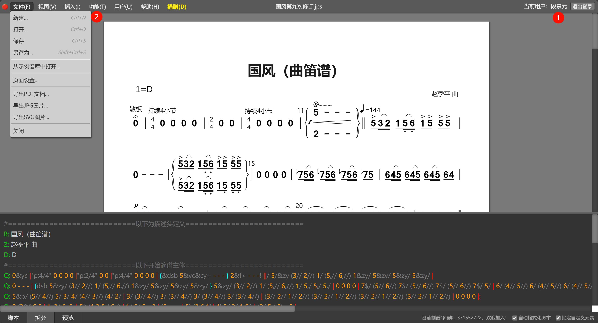

    这里只填写必要信息即可，因为随时可以修改。

    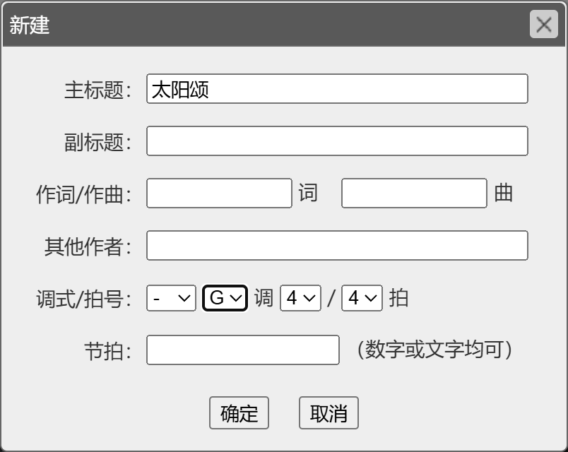

    您在预览区某位置点击鼠标，编辑区也会有反应，方便您修改简谱。

    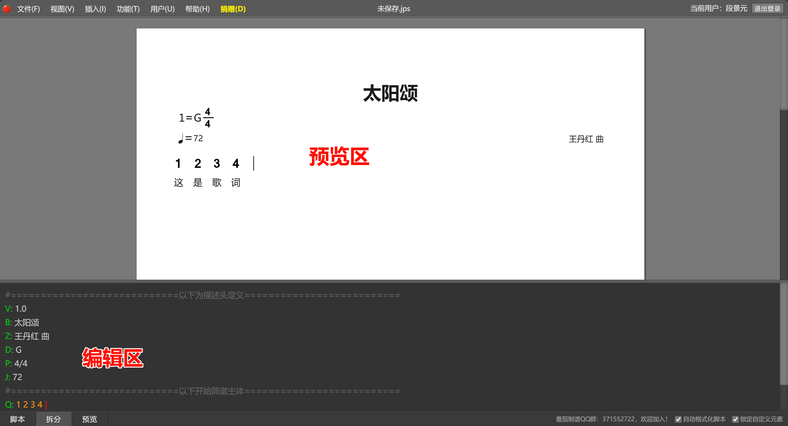

2. 在编辑区编辑信息

    修改信息后使用 PixPin 贴出第一行，准备翻译。

    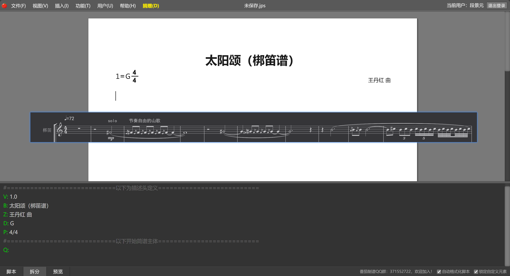

    先略过补充信息以及装饰音等，来到第一个要翻译的音。

    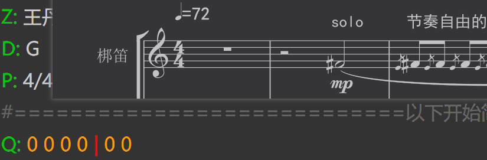

    根据此图我们就可以很好地对照出每个音来。读者可能会对五线谱中的`C`符号产生疑问，您可以简单地忽略掉它。它的作用是，`C`头部的小圆点处于第三间，这个位置对应了固定调的`C`音，对此您无需了解太多。还需要注意的一点是，表中的升降号都记在谱号后。小节中的升降号也会影响1 = ? 的判定，您会在后文体会到这一点（五线谱只有一个高音谱号，我却译为了 1 = A 而非 1 = C）。

    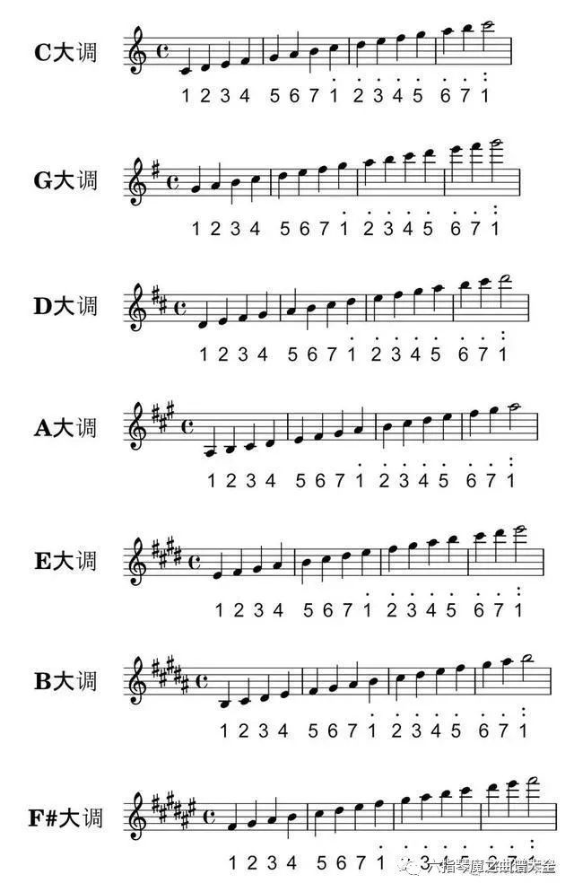

    我们看到，如果是 G 大调，升号作用在五线谱最高的一条线上，也就是第五线，这个音对应 1 = G 的 7。那么哪个位置对应低八度的 7 呢？答案是第一线和第二线中间，也就是第一间。**这个位置是受升号作用的**。

    来到五线谱，我们看到要翻译的第一个音前面带了一个升号，这完美地对应了 1 = G 的 7 （低八度），也稍印证了翻译为 1 = G 的正确性。

    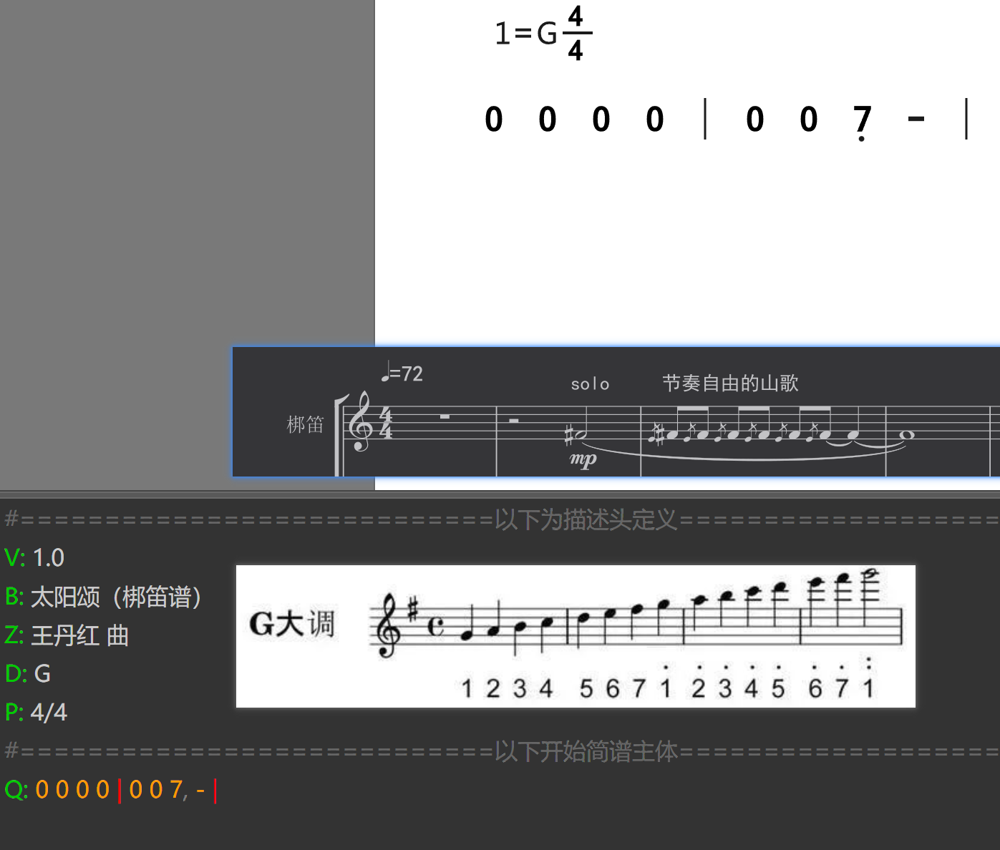

    关于番茄语法，可以参看官方的说明文档。从我目前写的部分，您可以了解到，`|`代表小节线，英文逗号`,`加在后面代表低八度。

    然后我们来到第三小节，您很快就会看到，这小节中只在开头出现了一个升号，可是，**这一小节内的全部此音都被升号作用着**。我们又会发现另一个细节——延音线。请注意，延音线连着的音，共享升降效果。

    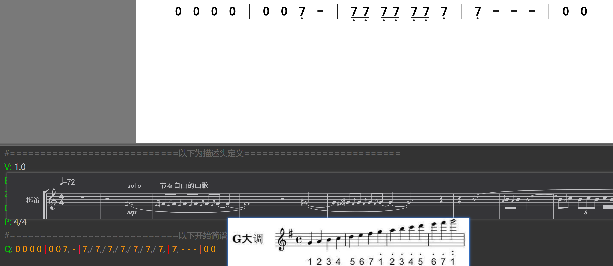

    翻译到这里，问题出现了，下一个音要翻译为`升 1`？这个音不常见，指法也比较困难，所以我们可以打算更换首调。对于梆笛，常用的调有 A、F，而 F 调是在出现降号时考虑的，所以我们可以考虑把首调换为 A 调。并且，由于这段是 solo，考虑采用独立的笛子也是比较自然的。

    根据**帮助**中的指南、符号表，我们完善第一行：

    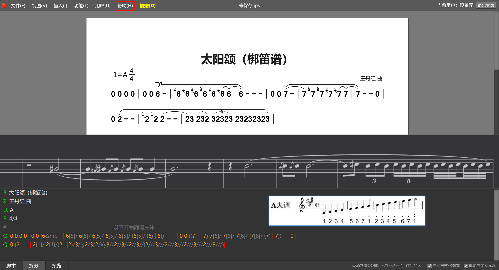

    可以看到，现在每个音的指法非常自然，并且主旋律没有出现任何升降号。这恰恰说明 1 = A 在这里是正确的。

    我们可以用**插入**功能，把节奏、solo 等信息标注好。

    继续翻译五线谱的第二行并添加信息、修正之前的一些错误。

    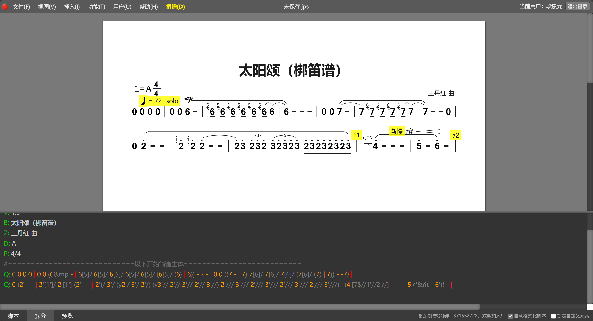

    rit 就是渐慢，五线谱 a2 就是进入了第二乐段。

    我们快速浏览 a2 后的谱子，发现几乎没有升降号和第五线上的音，这时我们可以这么考虑：该换回 1 = G 了。

    所以，我们可以给全曲确定 1 = G，而第一乐段的 1 = A 特殊标出即可。在该换笛子的时候，1 = ? 着重标出即可。

    翻译到 a2 乐段后，出现了另一个问题：临时多声部。番茄简谱可以做到临时多声部，但是在译谱的第一阶段，可以暂时先只译多声部的上部分。根据多声部的实际需要，用手写增补也算比较方便。简谱的多声部排版会严重影响到谱子的整体效果，尤其是在声部较多的情况下，在这里五线谱的优势被很好地体现了出来。

    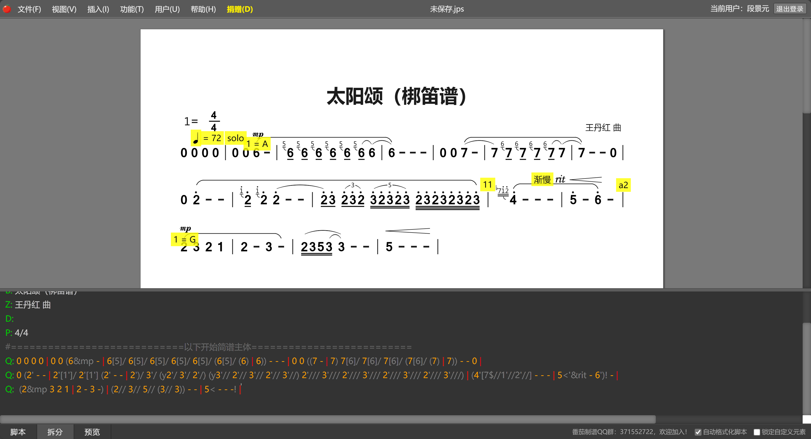

    至此，《太阳颂》的前两行就翻译完了。

    在熟悉了各种标记后，加标记和输入数字可以同步进行，避免鼠标回撤，节省时间。小节号、节奏、solo 等信息可以在最后排版确定后统一加，避免反复调整位置出现错误。

    如何保存我们的工作进度？

    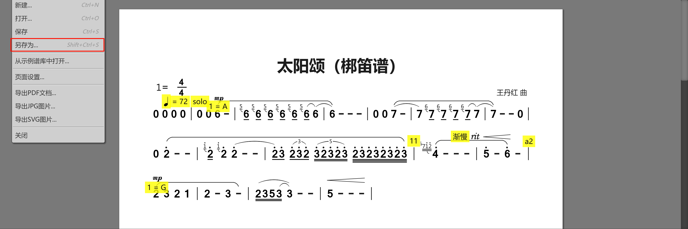

    在此处新建一个文件夹，保存为`太阳颂.jps`，下次用打开功能打开这个文件，就可以恢复进度了。“导出”功能可以方便地将简谱导出为PDF文件。

## 5. 附加说明

### 5.1 SumatraPDF 官网

[SumatraPDF 官网](https://www.sumatrapdfreader.org/free-pdf-reader)，更多信息您可进入后了解学习。

### 5.2 PixPin 官网

[PixPin 官网](https://pixpinapp.com/)，更多信息您可进入后了解学习。

主要是写到这里写累了，懒得夸这两个软件了（狗头。